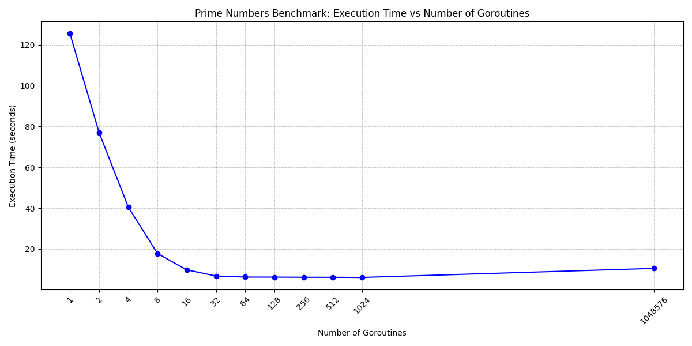
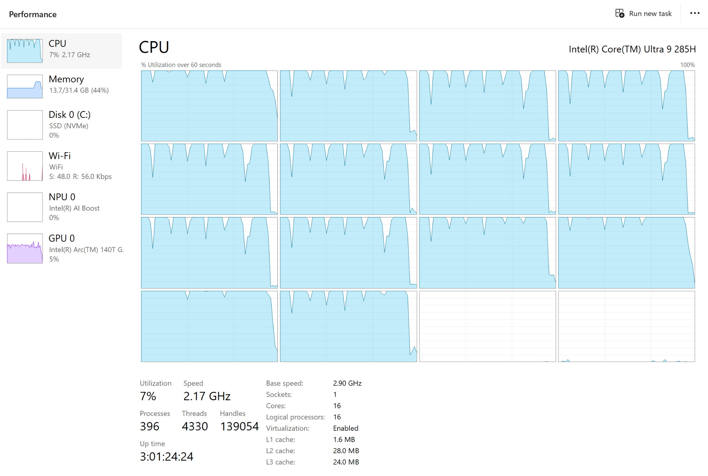

# Prime Numbers Benchmark

This project benchmarks concurrent prime number generation with varying goroutine counts

## Environment

- **OS/Architecture**: Windows amd64
- **CPU**: Intel® Core™ Ultra 9 285H
- **CPU Cores**: 16 (6 P-cores, 8 E-cores, 2 LPE-cores)

## Benchmark Results

| Goroutines | Time (ns/op)      | Memory (B/op)     | Allocations (allocs/op) |
|------------|-------------------|-------------------|-------------------------|
| 1          | 125,420,296,700   | 251,546,888       | 98                      |
| 2          | 76,938,597,800    | 251,539,176       | 67                      |
| 4          | 40,477,671,000    | 251,540,904       | 73                      |
| 8          | 17,790,908,800    | 251,547,816       | 95                      |
| 16         | 9,835,835,700     | 251,573,304       | 135                     |
| 32         | 6,820,413,900     | 251,551,288       | 134                     |
| **64**     | **6,295,622,800** | **251,571,704**   | **226**                 |
| 128        | 6,283,241,100     | 251,606,072       | 419                     |
| 256        | 6,203,425,900     | 251,682,712       | 766                     |
| 512        | 6,186,840,100     | 251,821,048       | 1424                    |
| 1024       | 6,116,187,200     | 251,955,224       | 2140                    |
| 1048576    | 10,549,599,700    | 915,673,784       | 3140421                 |

## Insights

- Execution time drops sharply up to ~32 goroutines, showing strong parallel speedup
- Between 32 and 512 goroutines, performance improves gradually, then plateaus
- Extremely high concurrency (1,048,576 goroutines) adds overhead, slowing execution
- Memory usage and allocations increase steadily with more goroutines

---

## CPU Usage Insights

- Only about 14 cores were heavily utilized during benchmarks, likely excluding energy-efficient cores
- Various power modes were tested (Silent, Balanced, Turbo) with notable differences in performance and GPU usage  
- Performance difference between Silent and Turbo modes reached up to ~50% for 32 workers and ~85% for 1024 workers 

---

## Power Mode Performance Comparison (time in ns/op)

| Mode     | 1 Worker     | 8 Workers    | 32 Workers   | 1024 Workers  |
|----------|--------------|--------------|--------------|---------------|
| Silent   | 127.7 billion| 20.7 billion | 10.8 billion | 11.7 billion  |
| Balanced | 106.7 billion| 19.9 billion | 8.2 billion  | 8.0 billion   |
| Turbo    | 128.1 billion| 18.2 billion | 6.7 billion  | 6.3 billion   |

---

## Additional Notes

- In Silent and Balanced modes, GPU was more active (likely used for `sqrt` calculations)
- In Turbo mode, GPU usage was minimal